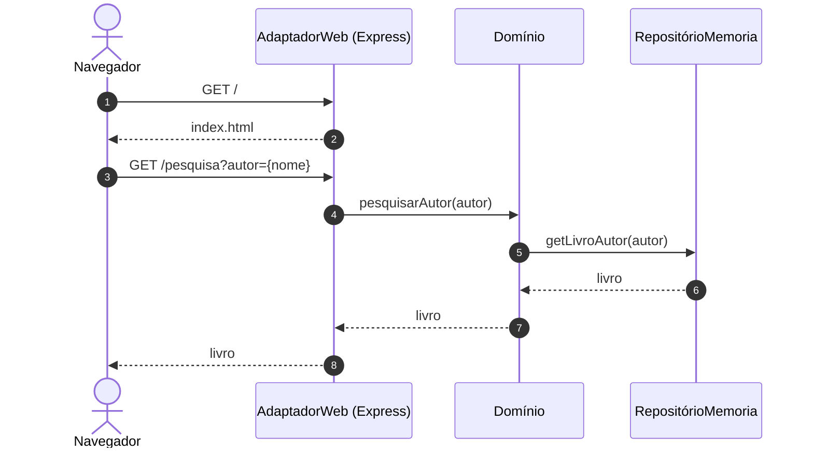

# Exemplo de Arquitetura Hexagonal em JavaScript

Exemplo de uma aplicação JavaScript que segue uma Arquitetura Hexagonal, com motivação didática apenas.

Ela está implementada em vanilla JavaScript e, basicamente, usa apenas funções (evitamos inclusive o uso de classes).

Para facilitar o entendimento, a interface Web é muito simples também

## Como Executar?

Para executar, digite no diretório ```hexagonal-js```:

```node install express```

```node server.js```

E depois entre em um browser e digite:

http://localhost:3000

## Diagrama de Sequência


