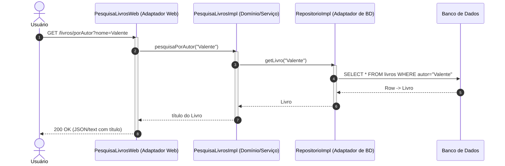

# Exemplo de Arquitetura Hexagonal em Java

Exemplo mínimo de uma aplicação Java que segue uma Arquitetura Hexagonal, com motivação didática apenas.

## Como Executar?

Para executar a aplicação, digite no diretório ```hexagonal```:

```java -jar target/hexagonal-1.0.0-SNAPSHOT-all.jar```

E depois entre em um browser e digite:

http://localhost:4567

* * *

Se preferir, você pode também compilar e depois executar usando o maven:

```mvn compile```

```mvn -q exec:java```


## Diagrama de Sequência


