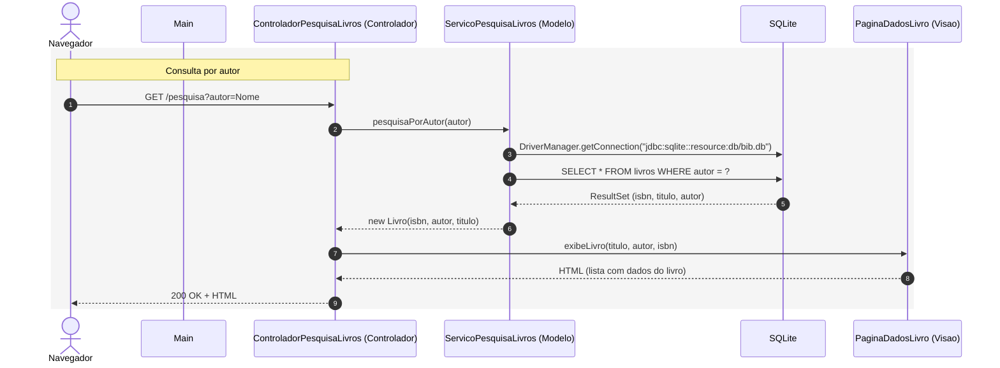

# Exemplo de MVC

Exemplo mínimo de uma aplicação Java que segue uma Arquitetura MVC, com motivação didática apenas.

## Como Executar?

Digite no diretório ```mvc```:

```java -jar target/mvc-1.0.0-SNAPSHOT-all.jar```

E depois entre em um browser e digite:

http://localhost:4567

* * *

Se preferir, você pode também compilar e depois executar usando o maven:

```mvn compile```

```mvn -q exec:java```

## Diagrama de Sequência



